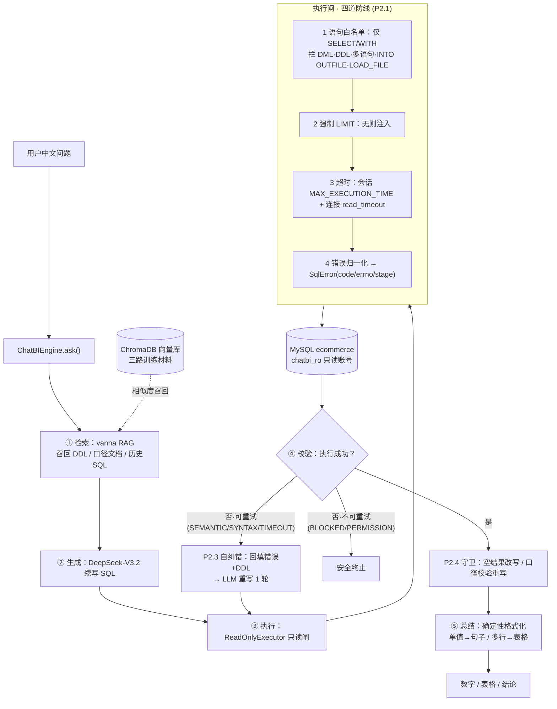

# ChatBI · Olist 电商数仓自然语言问数 Agent

把已交付的 **Olist 电商 MySQL 数仓（9 表 / 155 万行）** 从"人写 SQL 出报表"升级为"用中文直接问数"：

> 自然语言提问 → RAG 检索口径与历史 SQL → LLM 生成 SQL → **只读执行闸** → 校验 →（自纠错 / 口径·空结果守卫）→ 返回数字、表格与结论。

**评估准确率：29/30 = 96.7%**（30 题留出集，执行结果比对口径，详见 [`eval/report.md`](eval/report.md)）

技术栈：Python 3.12 · **LangGraph（编排状态图）** · vanna 0.7.9（NL2SQL RAG）· ChromaDB · DeepSeek-V3.2（经 SiliconFlow）· pymysql + MySQL 8.4 · pytest。**零 GPU、全云端 API**。

---

## 架构



**关键设计**：编排流程用 **LangGraph StateGraph** 显式表达（[`chatbi/graph.py`](chatbi/graph.py)：节点=生成/执行/自纠错/守卫/总结，条件边=失败→自纠错、违规→重写复跑、成功→总结，环靠重试上限收敛）；vanna 只负责"检索 + 生成"，**执行权交给自写的 `ReadOnlyExecutor`**（不用 `vanna.run_sql`）——即使用编排框架，执行安全闸仍是自有组件、可逐行讲；安全靠**架构双保险**（应用层白名单 + DB 只读账号），不靠 prompt（见 [`docs/DECISIONS.md`](docs/DECISIONS.md) D3/D6/D7）。

---

## 目录结构

```
chatbi/                     # 编排层产品代码
  graph.py                  # LangGraph StateGraph 编排（节点 + 条件路由）
  engine.py                 # 引擎：持有资源 + 被图节点复用的 helper + ask/run_sql 入口
  executor.py               # P2.1 只读 SQL 执行闸（四道防线）
  guards.py                 # P2.4 口径/空结果守卫规则（纯函数）
  comparator.py             # P3.2 结果行级规范化比对器
main.py                     # 端到端入口（CLI 问数）
scripts/
  create_readonly_user.py   # 建 chatbi_ro 只读账号（root 密码交互输入）
  train.py                  # 构建向量库（复现第一步）
  train_and_test.py         # P1.4 三路训练 + 试跑
  p1_5_sampling.py          # P1.5 30 题临时抽测 + 调优
  gen_schema_doc.py         # 从库生成 docs/schema.md
  run_eval.py               # P3.3 评估跑分 → eval/report.md
  verify_eval.py            # P3.1 评估集人工验证
  demo_self_correction.py   # P2.3 自愈 demo
  demo_guards.py            # P2.4 守卫 demo
  smoke_test.py / diag_api.py
eval/
  questions.yaml            # 30 题留出评估集（标准 SQL + 口径标注）
  verified_results.json     # 标准 SQL 验证快照
  report.md                 # 准确率报告
tests/                      # pytest（51 项）
docs/
  schema.md                 # 9 表 DDL + 中文注释（从库生成）
  metrics.md                # 指标口径（唯一口径事实源）
  DECISIONS.md              # 工程决策与踩坑日志 D1–D6
  PLAN_v2.md                # 方案 v2.1
PROJECT_BRIEF.md            # 共享内存 / 唯一事实源（三方协议）
```

---

## 复现步骤

### 0. 前置
- Python 3.12+ 与 [uv](https://github.com/astral-sh/uv)
- 一个已载入 **Olist 电商数据**的 MySQL 8.x 库 `ecommerce`（9 表，表结构见 [`docs/schema.md`](docs/schema.md)）。数据为公开 Olist (Brazilian E-Commerce) 数据集；注意本项目 ETL 已把官方数据集拼错的 `lenght` 修正为 `length`（见 DECISIONS D4）。
- 一个 SiliconFlow API Key（用于调 DeepSeek-V3.2）。

### 1. 安装依赖
```bash
cd <项目目录>
uv sync
```

### 2. 配置凭据（均不进 git）
```bash
cp .env.example .env          # 然后编辑 .env 填入：SILICONFLOW_API_KEY=<你的Key>
```
只读账号连接信息 `config/db_ro.env` 由下一步脚本自动生成，无需手写。

### 3. 建只读账号 chatbi_ro（仅 SELECT）
```bash
uv run python scripts/create_readonly_user.py
# 按提示在终端输入 MySQL root 密码（不回显、不经聊天、不落日志）
# → 随机 20 位密码，创建 chatbi_ro@localhost 仅授 SELECT ON ecommerce.*
# → 凭据写入 config/db_ro.env（已 gitignore）
```

### 4. 构建向量库（三路训练）
```bash
uv run python scripts/train.py
```

### 5. 端到端问数
```bash
uv run python main.py                          # 跑 3 个内置 demo 问题
uv run python main.py "2017年黑五的GMV是多少？"  # 或自定义问题
```

### 5b. 网页界面（Streamlit 壳）
```bash
uv run streamlit run app.py                    # 浏览器对话式问数：输入框 → SQL → 表格 → 结论 + LangGraph 编排折叠区
```
界面为纯壳：只调用 `ChatBIEngine.ask()`，引擎实例经 `st.cache_resource` 缓存（避免每问重连 MySQL / 重载 chroma）；凭据仍只走 `.env` / `config/db_ro.env`。

### 6. 评估跑分（产出准确率报告）
```bash
uv run python scripts/run_eval.py              # → 重写 eval/report.md
```

### 7. 跑测试
```bash
uv run pytest                                  # 51 passed
```

---

## 评估

- **评估集**：[`eval/questions.yaml`](eval/questions.yaml)，30 题留出集（单表聚合 8 / 多表关联 10 / 时序环比 6 / 排名对比 6），问法与训练问答对不逐字重合（测泛化非记忆）。
- **口径**：分母=30，分子=**执行成功且结果一致**（行级规范化比对：排序无关、数值 2 位容差；SQL 文本相似度不计）。
- **结果**：总 **96.7%**；单表聚合 100% / 多表关联 100% / 时序环比 83% / 排名对比 100%。
- 唯一未过题（Q23）为**比对器保守假阴性**——生成用 `DATE_FORMAT '%Y-%m'`、标准用 `MONTH()`，数据完全一致仅表示不同；按严格口径如实记录，不做"魔法对齐"骗分（真实语义准确率 30/30）。
- 详见 [`eval/report.md`](eval/report.md)。

---

## 安全模型（只读双保险）

| 层 | 手段 | 作用 |
|---|---|---|
| 应用层 | `ReadOnlyExecutor` 语句白名单 + 强制 LIMIT + 超时 | 不触库即拒危险语句；防百万行回传；慢查询服务端掐断 |
| DB 层 | `chatbi_ro` 账号仅 `GRANT SELECT` | 最终硬闸，即使白名单被绕过也无法写库 |

LLM 生成的 SQL 存在幻觉风险（可能输出 DELETE/DROP）。**安全靠架构不靠 prompt**：两层各司其职，任一层失效另一层仍在。自纠错/守卫的重写产物也一律再过执行闸二次安检。详见 [`docs/DECISIONS.md`](docs/DECISIONS.md) D3、D6。

---

## 红线

- `.env`、`config/*.env`（含 API Key、DB 密码）**永不进 git**（`.gitignore` 首条），**永不进 AI 上下文**。
- 数据库一律用只读账号 `chatbi_ro` 连接。
- `chroma/`、`logs/` 为运行产物，已 gitignore，不入库。
