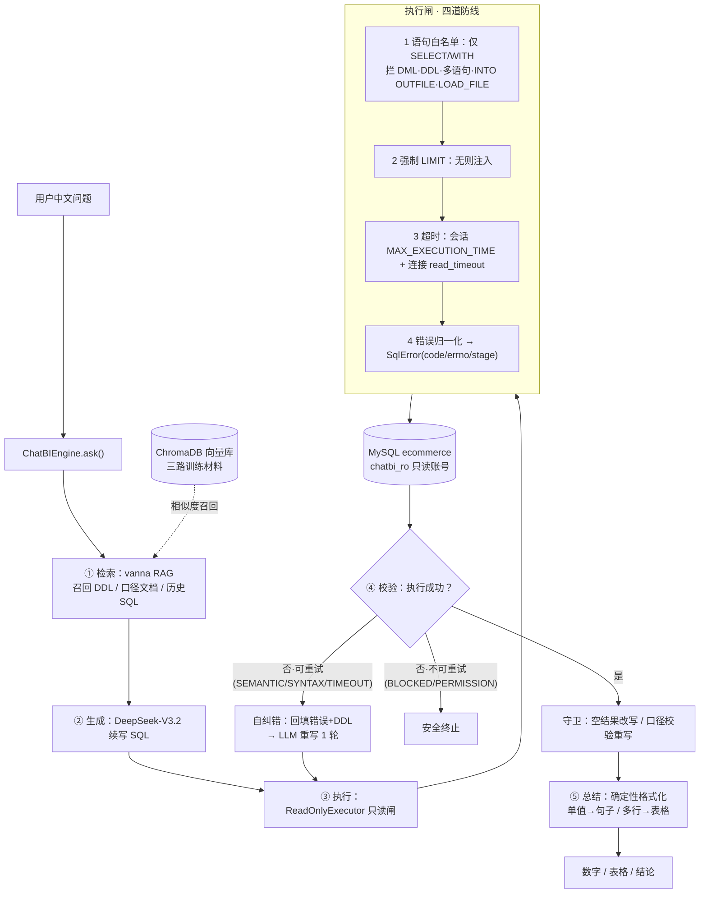

# ChatBI · Olist 电商数仓自然语言问数 Agent

把已交付的 **Olist 电商 MySQL 数仓（9 表 / 155 万行）** 从"人写 SQL 出报表"升级为"用中文直接问数"：

> 自然语言提问 → RAG 检索口径与历史 SQL → LLM 生成 SQL → **只读执行闸** → 校验 →（自纠错 / 口径·空结果守卫）→ 返回数字、表格与结论。

**评估准确率：93.3~96.7%**（30 题留出集；LLM 生成非确定性，多次运行在此区间波动，详见 [`eval/report.md`](eval/report.md)）

技术栈：Python 3.12 · **LangGraph（编排状态图）** · vanna 0.7.9（NL2SQL RAG）· ChromaDB · DeepSeek-V3.2（经 SiliconFlow）· pymysql + MySQL 8.4 · pytest。**零 GPU、全云端 API**。

**引擎与训练材料分离**：Olist 是默认数据集，`scripts/onboard.py` 可把任意 MySQL 库**或一个 CSV 文件**接入为并列的新数据集，换数据源不改代码（见下文[「接入你自己的数据库」](#接入你自己的数据库)）。

---

## 架构


```mermaid
flowchart TD
    U["用户中文问题"] --> ASK["ChatBIEngine.ask()"]
    ASK --> RET["① 检索：vanna RAG<br/>召回 DDL / 口径文档 / 历史SQL"]
    CH[("ChromaDB 向量库<br/>三路训练材料")] -. 相似度召回 .-> RET
    RET --> GEN["② 生成：DeepSeek-V3.2 续写 SQL"]
    GEN --> EXE["③ 执行：ReadOnlyExecutor 只读闸"]

    subgraph GUARD["执行闸 · 四道防线"]
        direction TB
        W["1 语句白名单：仅 SELECT/WITH<br/>拦 DML·DDL·多语句·INTO OUTFILE·LOAD_FILE"]
        W --> LM["2 强制 LIMIT：无则注入"]
        LM --> TO["3 超时：会话 MAX_EXECUTION_TIME + 连接 read_timeout"]
        TO --> NE["4 错误归一化 → SqlError(code/errno/stage)"]
    end
    EXE --> GUARD
    GUARD --> DB[("MySQL ecommerce<br/>chatbi_ro 只读账号")]

    DB --> CHK{"④ 校验：执行成功？"}
    CHK -- "否·可重试<br/>(SEMANTIC/SYNTAX/TIMEOUT)" --> SC["自纠错：回填错误+DDL<br/>→ LLM 重写 1 轮"]
    SC --> EXE
    CHK -- "否·不可重试<br/>(BLOCKED/PERMISSION)" --> FAIL["安全终止"]
    CHK -- "是" --> G2["守卫：空结果改写 / 口径校验重写"]
    G2 --> SUM["⑤ 总结：确定性格式化<br/>单值→句子 / 多行→表格"]
    SUM --> ANS["数字 / 表格 / 结论"]
```

**关键设计**：编排流程用 **LangGraph StateGraph** 显式表达（[`chatbi/graph.py`](chatbi/graph.py)：节点=生成/执行/自纠错/守卫/总结，条件边=失败→自纠错、违规→重写复跑、成功→总结，环由重试上限终止）；vanna 只负责"检索 + 生成"，**执行权交给自写的 `ReadOnlyExecutor`**（不用 `vanna.run_sql`）——即使用编排框架，执行安全闸仍是自有组件、可逐行讲；安全靠**架构双保险**（应用层白名单 + DB 只读账号），不靠 prompt（见 [`docs/DECISIONS.md`](docs/DECISIONS.md) D3/D6/D7）。

---

## 目录结构

```
chatbi/                     # 产品代码包
  graph.py                  # LangGraph StateGraph 编排（节点 + 条件路由）
  engine.py                 # 引擎：持有资源 + 被图节点复用的 helper + ask/run_sql 入口
  executor.py               # 只读 SQL 执行闸（四道防线）
  guards.py                 # 口径/空结果守卫规则（纯函数）
  comparator.py             # 结果行级规范化比对器
  knowledge.py              # 知识层单源：三路训练材料 + 向量库构建流程
  datasets.py               # 数据集解析：按名解析材料 / 库凭据 / 向量库 / 口径规则
  onboarding.py             # 数据源接入实现正源（提表结构→生成材料→训练→试跑）
  csv_import.py             # CSV→SQLite 导入器（编码/分隔符/表头/类型推断兜底）
  secrets.py                # 凭据/配置解析单源（.env 与 config/db_*.env，均不入库）
  ui_helpers.py             # 前端纯函数（图表推断/格式化/徽标/时间线/CSV）
main.py                     # 端到端入口（CLI 问数，--dataset 切数据集）
app.py                      # Streamlit 网页前端（答案优先多轮对话）
assets/style.css            # 前端品牌样式
scripts/
  create_readonly_user.py   # 建 chatbi_ro 只读账号（root 密码交互输入）
  onboard.py                # 一键接入新 MySQL 库（薄 CLI，实现在 chatbi/onboarding.py）
  install_sakila.py         # 装 MySQL 官方示例库 sakila + 建其只读账号（跨领域验证用）
  train.py                  # 构建向量库（--dataset 指定；实现在 chatbi/knowledge.py）
  gen_schema_doc.py         # 从库生成 docs/schema.md
  run_eval.py               # 评估跑分 → eval/report.md
  verify_eval.py            # 评估集锚点验证 → eval/verified_results.json
  accept_ui.py              # 前端自动化验证（AppTest）
  demo_self_correction.py   # 自纠错演示
  demo_guards.py            # 守卫演示
  archive/                  # 历史一次性脚本（冒烟/排障/早期训练，见其 README）
datasets/                   # 非默认数据集（由 onboard.py 生成；Olist 不在此，见下）
  <name>/schema.md          #   表结构：完整 DDL + 行数 + 外键
  <name>/metrics.md         #   指标口径候选（待人工确认）
  <name>/qa.yaml            #   问答对（标准 SQL 均实跑验证过）
  <name>/dataset.yaml       #   后端清单（backend: mysql|sqlite、库文件位置）
  <name>/onboarding_report.md #  接入报告（含自动化边界）
  <name>/data.db            #   CSV 导入的 SQLite 库（gitignore，可由 CSV 重建）
  <name>/chroma/            #   该数据集独立向量库（gitignore）
eval/
  questions.yaml            # 30 题留出评估集（标准 SQL + 口径标注）
  verified_results.json     # 标准 SQL 验证快照
  report.md                 # 准确率报告
tests/                      # pytest（159 项）
docs/
  schema.md                 # 9 表 DDL + 中文注释（从库生成）
  metrics.md                # 指标口径（唯一口径事实源）
  DECISIONS.md              # 工程决策与踩坑日志 D1–D7
  ARCHITECTURE.md            # 分层/职责/调用边界/状态机/依赖清单
```

---

## 复现步骤

### 0. 前置
- Python 3.12+ 与 [uv](https://github.com/astral-sh/uv)
- 一个已载入 **Olist 电商数据**的 MySQL 8.x 库 `ecommerce`（9 表，表结构见 [`docs/schema.md`](docs/schema.md)）。数据为公开 Olist (Brazilian E-Commerce) 数据集；注意本项目 ETL 已把官方数据集拼错的 `lenght` 修正为 `length`（见 DECISIONS D4）。
- 一个 SiliconFlow API Key（用于调 DeepSeek-V3.2）。

### 1. 安装依赖
```bash
cd <项目目录>
uv sync
```

### 2. 配置凭据（均不进 git）
```bash
cp .env.example .env          # 然后编辑 .env 填入：SILICONFLOW_API_KEY=<你的Key>
```
只读账号连接信息 `config/db_ro.env` 由下一步脚本自动生成，无需手写。

### 3. 建只读账号 chatbi_ro（仅 SELECT）
```bash
uv run python scripts/create_readonly_user.py
# 按提示在终端输入 MySQL root 密码（不回显、不经聊天、不落日志）
# → 随机 20 位密码，创建 chatbi_ro@localhost 仅授 SELECT ON ecommerce.*
# → 凭据写入 config/db_ro.env（已 gitignore）
```

### 4. 构建向量库（三路训练）
```bash
uv run python scripts/train.py
```

### 5. 端到端问数
```bash
uv run python main.py                          # 跑 3 个内置 demo 问题
uv run python main.py "2017年黑五的GMV是多少？"  # 或自定义问题
```

### 5b. 网页界面（Streamlit 壳 · 答案优先多轮对话）
```bash
uv run streamlit run app.py                    # 🪙 小数点 · 电商问数助手
```
界面为纯壳：只调用 `ChatBIEngine.ask()`（`st.cache_resource` 缓存引擎，多轮追问不重连 MySQL / 不重载 chroma）。
布局：示例 chips → 多轮聊天流；每条答案=徽标条（N 行·耗时·chatbi_ro 只读；自纠错/口径守卫命中仅触发时亮）→ 结论大字号 → 自动图表（plotly：单值指标卡 / 时序折线 / 类目横向条形，按结果形状推断）→ 数据表格 + CSV 导出 → SQL 折叠（可复制）→ LangGraph 编排时间线折叠。
品牌视觉与图表辅助在 `chatbi/ui_helpers.py` + `assets/style.css`；自动化验证脚本 `scripts/accept_ui.py`（AppTest，16 项）。
新增依赖：plotly 7.0.0（交互式图表；锁定于 uv.lock）。凭据仍只走 `.env` / `config/db_ro.env`（永不进 git）。

### 6. 评估跑分（产出准确率报告）
```bash
uv run python scripts/run_eval.py              # → 重写 eval/report.md
```

### 7. 跑测试
```bash
uv run pytest                                  # 106 passed
```

---

## 接入你自己的数据库

引擎与训练材料是分离的：换库不改代码，只需给一套新材料 + 一个只读账号。Olist 是默认数据集，新库与它并列存在、互不影响。

### 1. 为目标库准备最小权限只读账号

安全前提与 Olist 一致（见下文「安全模型」）：**不要用管理员账号接入**。建一个仅 `SELECT` 的账号，把连接信息写成 `config/db_<数据集名>.env`（已 gitignore）：

```
host=127.0.0.1
port=3306
user=your_readonly_user
password=...
database=your_db
```

也可以不写这个文件，直接跑下一步用交互式输入（脚本会替你写入）。

### 2. 跑接入脚本

```bash
uv run python scripts/onboard.py --dataset <名字> --db-env config/db_<名字>.env
uv run python scripts/onboard.py                 # 或全交互式输入连接信息
```

五步：① 读库提取全部基表的**完整 DDL**、行数、外键 → ② LLM 生成**候选**指标口径 → ③ LLM 生成问答对，**每条标准 SQL 都用只读账号实跑验证**，跑不通的当场淘汰 → ④ 用通过验证的材料训练该数据集**独立**向量库 → ⑤ 抽 3 题走完整链路试跑，与标准 SQL 结果行级比对。

产物都在 `datasets/<名字>/`：`schema.md`、`metrics.md`、`qa.yaml`、`chroma/`（gitignore）、`onboarding_report.md`（接入报告）。

### 3. 提问

```bash
uv run python main.py --dataset <名字> "你的问题"
uv run python main.py --dataset <名字>            # 不给问题则用该数据集的已验证示例题
uv run python scripts/train.py --dataset <名字>   # 用已落盘材料重建向量库（不再调 LLM 生成）
```

### 自动化边界：哪些自动、哪些必须人工

**不是全自动**——接入能自动跑通问数，但口径正确性不是脚本能保证的：

| 环节 | 程度 | 说明 |
|---|---|---|
| 表结构 / 行数 / 外键 | 自动 · **事实** | 读自 `SHOW CREATE TABLE`、`COUNT(*)`、`information_schema`，不是猜的 |
| 问答对标准 SQL | 自动 · **已验证** | 每条实跑通过才进训练材料；淘汰项在接入报告里逐条列出、不静默丢弃 |
| 向量库训练与试跑 | 自动 | 三路材料 + 固定时序（干净重建 → 训练 → 等待落盘 → 重实例化） |
| **指标口径** | **候选 · 需人工确认** | 口径是业务定义（"活跃用户"怎么算、金额含不含税、要不要排除取消单），LLM 只能给假设 |
| JOIN 语义 / 去重键 | **需人工确认** | 外键只给出结构关系；业务上该怎么 JOIN、按什么去重仍需人判断 |
| 准确率 | **需人工** | 接入只跑 3 题证明链路通，**不等于准确率**；正式数字需另建留出评估集 |

因此有一条刻意的设计：**未经人工确认的口径不会被当作守卫规则强制生效**（非默认数据集的口径规则为空，见 [`chatbi/datasets.py`](chatbi/datasets.py)）。拿没确认的口径去强制重写 SQL，会把本来正确的查询改错——本项目在 Olist 评估期踩过一次同类坑（口径规则关键词过宽，误命中支付类问题）。人工确认后可把口径固化成规则，方式见 [`chatbi/guards.py`](chatbi/guards.py)。

### 用你自己的 CSV（无需任何数据库）

没有数据库也能接：CSV 先自动建表导入一个 SQLite 库文件，再走同一套接入流程。

```bash
uv run python scripts/onboard.py --csv 你的文件.csv --dataset <名字>
# 无表头的 CSV 统计上无法与有表头文件区分，需人工给列名：
uv run python scripts/onboard.py --csv iris.data --dataset iris \
    --header-names sepal_length,sepal_width,petal_length,petal_width,species
```

导入的自动兜底：编码（utf-8 / GBK 自动探测）、分隔符（逗号 / 分号 / 制表符 / 竖线，按引号外计数判定）、空值转 NULL、短行补空长行截断、列名清洗（去 BOM 与包裹引号、非法字符转下划线、重名加序号）、按列抽样推断 INTEGER / REAL / TEXT。生成的 SQLite 库以**只读模式**打开——与 MySQL 只读账号同级的第二道闸。

SQL 方言自动适配：生成提示词会声明 SQLite 方言（日期是 TEXT、用 `substr`/`strftime`、`CASE WHEN` 而非 `IF()`、不用反引号与 `DATE_FORMAT`）。实测生成的时序 SQL 用的是 `substr(ts,1,7)` 与 `JULIANDAY()`，无 MySQL 专有函数。

**CSV 特有的自动化边界**：

| 环节 | 程度 | 说明 |
|---|---|---|
| 编码 / 分隔符 / 空值 / 行宽 | 自动 · 有兜底 | 见上；都不命中时退 latin-1，宁可个别乱码不丢行 |
| 列类型 | 自动 · 抽样推断 | 个别与列类型不符的脏值保留原文，**不丢行** |
| **表头** | **部分自动** | 有数值信号时自动判定（如 iris.data 型）；**全文本的无表头文件需 `--header-names` 人工给列名** |
| 列名的业务含义 | **需人工** | 合成列名 `col_1..` 会显著降低问数效果，脚本会明确警告 |
| 表间关系 | **需人工** | 单个 CSV 只有一张表、无外键；多文件→多表为第二步，未做 |

**实测（2026-10-08）**：用 99,441 行的真实订单 CSV（带引号表头、时间戳列）跑通全链路——导入 99,441 行、生成 12 组问答对验证通过 10 组（2 组因 LLM 臆造了数据中不存在的年份、实跑 0 行而被淘汰）、试跑 3/3 通过、追加 3 题与直查逐字一致（订单总数 99,441、已送达 96,478、2017-11 下单 7,544）。报告见 `datasets/olist_csv/onboarding_report.md`。

### 跨领域验证：MySQL 官方示例库 sakila

为证明"换个业务领域也能用"（而不是只在电商数据上凑效），用官方 sakila（影视租赁，16 表）做完整接入：

```bash
uv run python scripts/install_sakila.py       # 装官方 sakila + 建 chatbi_ro_sakila 只读账号（需交互输入 root 密码）
uv run python scripts/onboard.py --dataset sakila --db-env config/db_sakila.env
uv run python main.py --dataset sakila "一共有多少部影片？"
```

`install_sakila.py` 走 mysql 客户端而非 pymysql 装载：sakila 的 schema 含 `DELIMITER`、触发器、视图与存储过程，而 `DELIMITER` 是客户端指令、不是 SQL 语句，pymysql 逐条执行会报错。sakila 原始 SQL 与向量库均已 gitignore；接入产物（材料 + 报告）在 `datasets/sakila/`。

**实测（2026-10-08）**：onboard 生成 12 组问答对、**全部实跑验证通过**（0 淘汰）；试跑 **3/3 通过**（与标准 SQL 行级比对）；另追加 3 题与参考 SQL 逐字一致——影片总数 1000、城市最多的国家 India（60 城）、2005 年 8 月支付总额 24,070.14。完整证据见 [`datasets/sakila/onboarding_report.md`](datasets/sakila/onboarding_report.md)。

> Olist 仍是默认数据集，其材料仍在 `chatbi/knowledge.py` 与 `docs/` 下，**未迁入** `datasets/` 统一格式——两套并列，Olist 的既有行为与评估口径不受影响。

---

## 评估

- **评估集**：[`eval/questions.yaml`](eval/questions.yaml)，30 题留出集（单表聚合 8 / 多表关联 10 / 时序环比 6 / 排名对比 6），问法与训练问答对不逐字重合（测泛化非记忆）。
- **口径**：分母=30，分子=**执行成功且结果一致**（行级规范化比对：排序无关、数值 2 位容差；SQL 文本相似度不计）。
- **结果**：多次运行 **93.3~96.7%**；单表聚合 / 多表关联 / 排名对比多次满分，时序环比受 Q23 表示差异略低。
- 持续未过题（Q23）为**比对器保守假阴性**——生成用 `DATE_FORMAT '%Y-%m'`、标准用 `MONTH()`，数据完全一致仅表示不同；按严格口径如实记录，不做"魔法对齐"骗分（真实语义准确率 30/30）。
- 详见 [`eval/report.md`](eval/report.md)。

---

## 安全模型（只读双保险）

| 层 | 手段 | 作用 |
|---|---|---|
| 应用层 | `ReadOnlyExecutor` 语句白名单 + 强制 LIMIT + 超时 | 不触库即拒危险语句；防百万行回传；慢查询服务端掐断 |
| DB 层 | `chatbi_ro` 账号仅 `GRANT SELECT` | 最终硬闸，即使白名单被绕过也无法写库 |

LLM 生成的 SQL 存在幻觉风险（可能输出 DELETE/DROP）。**安全靠架构不靠 prompt**：两层各司其职，任一层失效另一层仍在。自纠错/守卫的重写产物也一律再过执行闸二次安检。详见 [`docs/DECISIONS.md`](docs/DECISIONS.md) D3、D6。

---

## 红线

- `.env`、`config/*.env`（含 API Key、DB 密码）**永不进 git**（`.gitignore` 首条）。
- 数据库一律用只读账号 `chatbi_ro` 连接。
- `chroma/`、`logs/` 为运行产物，已 gitignore，不入库。

## 关于开发方式

本项目开发过程使用 AI 编程工具辅助，全部代码经人工审核、理解并可逐行讲解。
